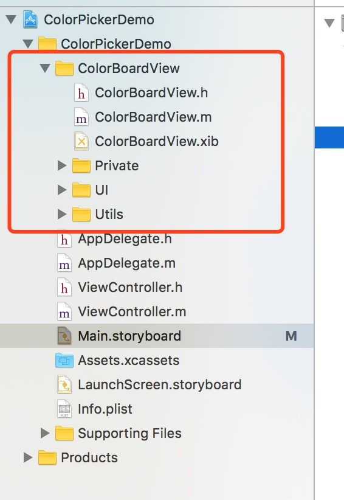
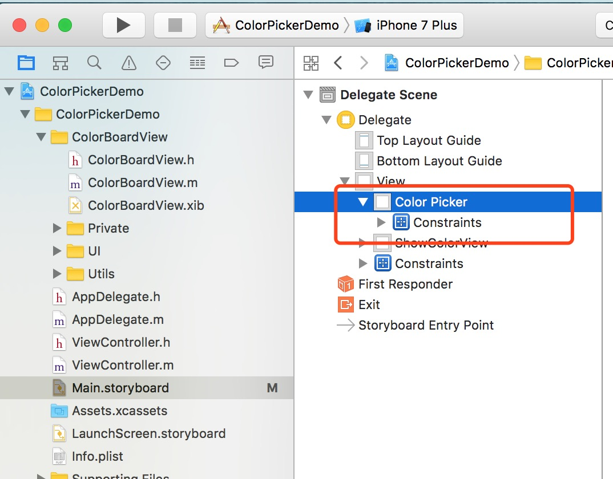
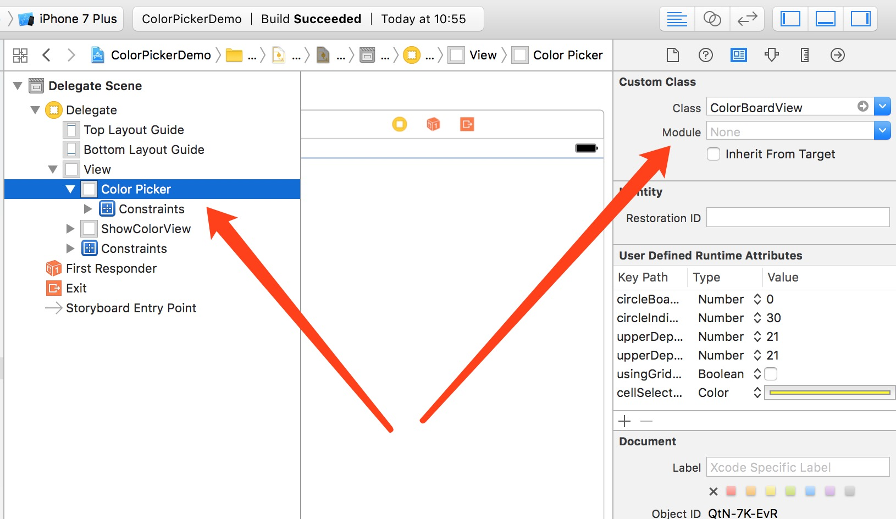
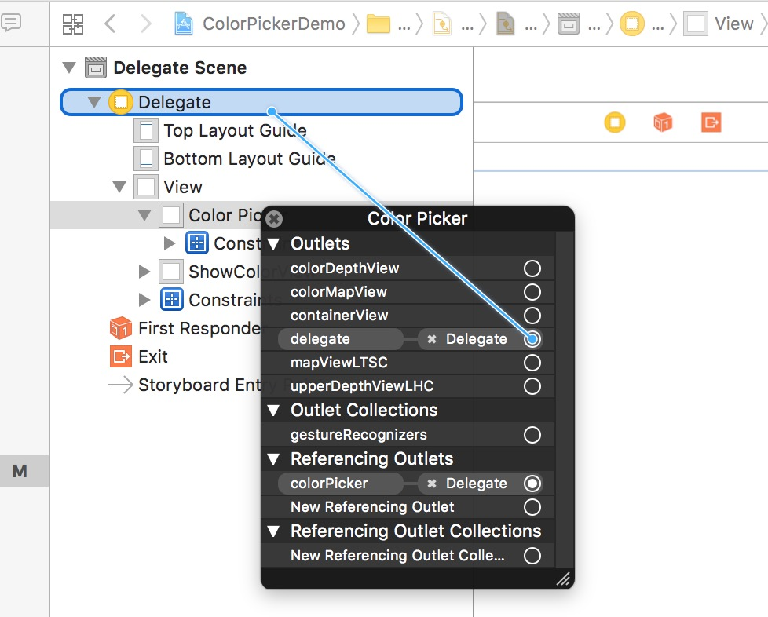

# CustomColorPicker

### 1、基本使用方法

**1. 将ColorBoardView文件夹及其中的所有文件一起拉到项目结构中；**



**2. 在布局中（StoryBoard或者xib）拉入一个子View，改名为ColorPicker（改名步骤非必须）；**



**3. 选中拉入的view（ColorPicker），修改右侧Custom Class中Class为ColorBoardView；**



**4. 右键拉入的ColorPicker，将ColorPicker的delegate设置为ColorPicker所在的ViewController。这一步也可以在view，或者ViewController中用代码设置。**



**5. 在ColorPicker所在的ViewController文件中拉入ColorPicker的引用（IBOutlet）,如果在布局文件中没有设置delegate，则需要代码设置ColorPicker的delegate**

**6. 在ViewController文件中实现ColorBoardViewDelegate以及委托方法：**

```objective-c
- (void)colorBoardView:(ColorBoardView *)colorBoardView HasPickedColor:(UIColor *)color {}
```

**7. 运行代码，在回调方法中可以获取选中的颜色**


### 高级使用方法，属性介绍


**在ColorBoardView.h中有对每个属性的说明**

```objective-c
#pragma mark - 布局信息

/**
 *  是否显示深度选则的view，即DepthView
 */
@property (nonatomic, assign) IBInspectable BOOL showDepth;

/**
 *  上面DepthView的圆圈提示的大小
 */
@property (nonatomic, assign) IBInspectable CGFloat circleBoarderWidth;
/**
 *  上面DepthView的圆圈的Boarder宽度
 */
@property (nonatomic, assign) IBInspectable CGFloat circleIndicatorLength;
/**
 *  在用户点击了下面的选取颜色的时候，是否展示 伸展出的方形提示框
 */
@property (nonatomic, assign) IBInspectable BOOL showIndicatorWhenTouchLowwerView;
/**
 *  上面DepthView的高度
 */
@property (nonatomic, assign) IBInspectable CGFloat upperDepthViewHeight;
/**
 *  上面DepthView的高度 iPad
 */
@property (nonatomic, assign) IBInspectable CGFloat upperDepthViewHeightiPad;


/**
 *  @author Pierce, 16-06-30 08:06:36
 *
 *  是否用网格Cell的形式展示颜色
 *
 */
@property (nonatomic, assign) IBInspectable BOOL    usingGridCell;
@property (nonatomic, strong) IBInspectable UIColor *cellSelectdBoraderColor;
```

